[options="header"]
[cols="1, 3, 3"]
|===
|Version | Bearbeitungsdatum   | Autor 
|0.8	|08.11.2019 |swt23w19
|===

:project_name: Miss Mending Point
:toc: left
:numbered:

= Entwicklerdokumentation

== Einführung und Ziele
=== Aufgabenstellung

_Note: In diesem Text wird für Gewöhnlich die männliche Form der Einfachheitshaleber benutzt. Es sind explizit alle Geschlechter angesprochen auch wenn nur die männliche Form benutzt wurde._
_Dieser Text befasst sich mit den notwendigen Features für die Benutzer der Software, daher werden auf Spezielle Funktionen des Programmcodes nicht eingegangen._ +
 +
Deutschland 2019, ein Land in dem das Informationszeitalter immernoch nicht angekommen ist und ein groß der Industrie keine vernpftige IT-Infrastruktur aufweist. +
Jedes Jahr gehen Millionen, wenn nicht Milliarden, Beträge durch veraltete Struturen und veraltete Technik verloren. Ein Ziel der Studenten des Software Technolgie Lehrstuhl ist es daher kleinen Unternehmen unter die Arme zu greifen in Fragen der IT. +
Hierfür arbeiten wir mit einer Filiale von Miss Mending Point zusammen. Die Kette Miss Mending Point kümmert sich um verschiedene Reparaturdienste und versucht somit die Umweltverschmutzung zu reduzieren. +
 +
Der "Reparaturshop Miss Mending Point" hat hierbei verschiedene Nutzer die mit dem System arbeiten, dabei sind verschiedene Berechtigung nötig um die Unternehmensstruktur abzubilden. Eine Nutzerbeschränkung ist dabei nicht zu beachten. Die Systemanforderung (im weiteren Dokument beschrieben) sollten jedoch bei Steigender Nutzerzahl angepasst werden. +
In unserem Fall ist es lediglich nötig, dass Mitarbeiter Zugriff auf das System haben und keine Kunden. Der Datenschutz des Kunden wird dabei GROSS geschrieben und daher werden nur Relevante Daten des Kunden im Finanzsystem erfasst. (Wie vom Gesetzgeber vorgeschrieben.) + 
Die Website an der sich die Mitarbeiter anmelden können, bietet dabei verschiedene Bereiche. Grundsätzlich unterteilt sich die Seite dabei in "Services", "Finanzenverwaltung", "Auftragsverwaltung und für die Leitung noch "Personalverwaltung", "Material". +
 +
Ein Mitarbeiter(auch die Leitung) der sich anmeldet und in den Bereich "Services" navigiert kann hier Aufträge anlegen. Bei dem Anlegen des Auftrages werden dabei verschiedene Daten erfasst, unter Anderem der erfordlicher Skill und der Kundenname. Danach bekommt der Kunde eine Rechnung in der ihm die Berarbeitungsgebühr/-kosten und Fertigstellungstermin beschrieben werden.(bzw. Abholschein) +
Im Bereich der Auftragsverwaltung kann ein Mitarbeiter (auch Leitung) die aktuellen Aufträge einsehen und diese ggf. Bearbeiten. Das nachträgliche Bearbeiten eines Auftrages erfolgt dann, wenn der Kunde den Auftrag zurückzieht oder sein Produkt abholt nach Fertigstellung. Sollte ein Auftrag bereits in der Bearbeitung sein, kann dieser nicht mehr zurückgezogen werden und es muss bis zur Fertigstelung des Auftrages gewartet werden. +
Nach der erfolgreichen Bearbeitung einens Auftrages soll der Auftragsstatus automatisch umgestellt werden von "In Bearbeitung" zu "Bearbeitet". +
Der Finanzverwaltungsbereich bietet den "normalen Mitarbeitern" und der Leitung unterschiedliche Funktionen und Umfang. Der Mitarbeiter kann unter Finanzverwaltung lediglich seinen eigenen Verdienst bzw. Lohneinsicht ansehen. Die Leitung kann neben der eigenen Lohneinsicht auch die Löhne der Mitarbeiter einsehen. Desweiteren sind für die Leitung die Gesamtbilanz der Filiale bzw. auch die Bilanz der einzelnen Monate einsehbar. +
Die Leitung hat in dem Bereich Material die Möglichkeit neues Material nach zu bestellen, sollte jedoch der Materialbestand unter einen festgelegten Wert fallen wird das Material automatisch nachbestellt.
Desweiteren kann die Leitung unter dem Bereich Personalverwaltung Mitarbeiter einstellen oder entlassen. Zu Beachten ist, dass sich "Miss Mending Point" an ein Neo Liberales Wirtschaftskonzept hält und Arbeiternehmerschutz NICHT groß geschrieben wird. +
 +
Ein normaler Geschäftsprozess ("ein normaler Auftrag") soll hierbei wie folgt ablaufen. Der Kunde kommt in die Filiale von "Miss Mending Point" und meldet sich an einem freien Schalter bei einem Mitarbeiter. Dieser Mitarbeiter entscheidet dann darüber ob der "Auftrag" angenommen wird oder nicht. 
Bei der Entscheidung den Auftrag anzunehmen meldet sich der Mitarbeiter im System an und begibt sich in den Bereich "Services". 
In diesem Bereich erstellt der Mitarbeiter dann einen Auftrag in dem er den "Service" auswählt und danach eine Produktberschreibung und Kundennamen angibt. 
Nachdem Abschicken des Formulars wird dem Mitarbeiter eine Rechnung mit voraussichtlichem Fertigstellungsdatum angezeigt, diese kann der Mitarbeiter dann gegen Vorabbezahlung austellen. 
Nachdem der Auftrag bearbeitet wurde, hat der Kunde die Möglichkeit diesen innerhalb von Sieben Tagen abzuholen, danach wird der Auftrag ins Lager verschoben und kostet 50 Cent extra pro Tag. Die Lagerung wird maximal 30 Tage gewährleistet, danach werden die Produkte gespendet. 
Nach Abholung bekommt der Kunde ggf. eine zweite Rechnung, z.b. bei Verzögerung eine Gutschrift und bei zu später Abholung eine weitere Rechnung. + 
 +
Die Ziele in diesem Projekt können wie folgt definiert werden: Sicherheit, Wartbarkeit und Benutzerfeundlichkeit. Die Wartbarkeit beschreibt dabei wie gut sich die Software in die Geschäftsprozesse eingliedert und diese darstellt. +

=== Qualitätsziele

Die Qualitätsziele werden nach "ISO/IEC 25010 Software Quality Model" beschrieben.

Sicherheit::
	Beschreibt die Integrität, Authentizität und Verantwortlichkeiten.

Wartbarkeit::
	Die Wartbarkeit beschreibt in wie gut sich die Geschäftsprozesse mit der Software darstellen lassen. Dabei sind bestimmte Punkte wie das Umstellen eines Status des Auftrags wichtig. Desweiteren wird ein Teil der Buchhaltung über die Software abgewickelt, so z.b. die monatliche Bilanz oder die Bezahlung der Mitarbeiter.

Benutzerfreundlichkeit::
	Beschreibt wie zugänglich und effizient die Software für die Benutzer ist.

Performance (nicht nach ISO)::
	Die Perfomance beschreibt wie effizient die Seite beim Nutzer geladen wird und wie viel Resourcen auf dem Webserver beansprucht werden.

Design (nicht nach ISO)::
	Das Design soll an die aktuellen Standards im Entwicklungsjahr angepasst sein.

1 = nicht Wichtig, 5 = sehr Wichtig
[option="header", cols="3h, ^1, ^1, ^1, ^1, ^1"]
|===
|Qualitätsziele 		| 1 | 2 | 3 | 4 | 5
|Sicherheit 			| 	| 	| 	| 	| x
|Wartbarkeit 			|	| 	| 	| x |
|Benutzerfreundlichkeit | 	|	| x |	|
|Performance 			|	| x |	|	|
|Design 				| x |	|	|	|
|===

== Randbedingungen
=== Hardware-Vorgaben
	* Server (Intel Xeon 6te Gen oder Vergleichbar, 8 Gb RAM, Gigabit Networkinterface)
	* Computer (Raspberry Pi 4b oder vergleichbar)
	* Bildschirm (720p)
	* Maus
	* Tastatur
	
=== Software-Vorgaben
==== Server:
	* Betriebssystem (WindowsServer oder Linux Server)
	* OpenJDK 11 (oder höher)
	
==== Client:
	* OS (mit Aktuellen Browser wie unten aufgeführt)
	* Chrome (Version 78.0 oder neuer)
	* Firefox (Version 70.0 oder neuer)

=== Vorgaben zum Betrieb des Software
Dieser Bereich beschreibt unter welchen Vorgaben das Produkt, nach Fertigstellung, benutzt werden sollte. +
 +
Das System soll nur intern (innerhalb EINER Filiale eines Reparaturshops) genutzt werden. Die Backend-Software läuft dabei auf einem Server von "Miss Mending Point", im Idealfall wird hierbei der Server im Filialnetz betrieben.
Sollte der Server ausserhalb des Filialnetz betrieben werden, sind weitere Kriterien, wie Internetverbindung für jeden Rechner in der Filialale und Internet Verbindung für den Server notwendig. 
Desweiteren sollte der Server über ein SSL Zertifikat (Idealerweise von einer CA authentifiziert sein) verfügen. Sowie nur einen eingeschränkten IP Bereich akzeptieren.
Alternativ zu diesen Lösung kann der Server auch in einem sicheren WAN betrieben werden.
Der Nutzer, welcher die Seite über einen Filialrechner erreicht nutzt dazu einen der oben aufgeführen Browser und ein Betriebssystem mit aktuellen Sicherheitspatches. Die Studenten des Lehrstuhls empfehlen hierbei den Netzwerkzugriff der Rechner lediglich auf den internen Server zu gestatten bzw. auch zu den Update Servern der Browser und Betriebssystem Server. +
 +
Das Design der Website richtet sich dabei an aktuelle Website Schemas und sollte daher auch für "weniger erfahrene"  Nutzer des Webs, leicht zugänglich sein. Für die Filialleitung ist die Seite um bestimmte Bereich (administrativer Natur) erweitert. +
Ansonsten sollte kein technisches Wissen seitens der Mitarbeiter oder Leitung nötig sein. +
 +
Das ganze System sollte dabei ohne Probleme oder technische Eingriffe funktionieren, die Studenten des Lehrstuhls werden das System so bereitstellen, dass der Chef alle Daten ohne SQL-Wissen oder der Gleichen bedienen kann.
Die Daten werden in einer persistenten H2 Datenbank auf dem Server gespeichert.

== Kontextabgrenzung
image:models/analysis/Kontextmodell.svg[Kontextdiagramm]

Hinweis: Es gibt es keine externen Schnittstellen, da wir Salespoint und Spring Security implementieren.

== Lösungsstrategie
=== Erfüllung der Qualitätsziele
[options="header"]
|=== 
|Qualitätsziel |Lösungsansatz
|Sicherheit a|
* *Integrität* Die unbefugte Benutzung des Systems oder spzieller System bereiche wird mittels _Spring Security_ umgesetzt. (@PreAuthorize - annotation)
* Verantwortlichkeiten
	Die Verwantwortlichkeiten werden mit zwei Rollen und mit sechs "Skillsets" umgesetzt. Die beiden Rollen sind dabei lediglich der "Mitarbeiter" und die "Leitung". Im vorherigen Text wurden die unterscheide genauer erläutert.
|Wartbarkeit a|
* *Automatisierung*	Zur Automatisierung wird der Status eines Auftrages automaitsch umgestellt nachdem dieser Bearbeitet wurde und automaitsch ins Lager verlegt. Die Buchaltung wird ebenfalls automatisch abgewickelt, sodass sich der Chef die Bilanz eines Monats bereits ausgerechnet anzeigen lassen kann. Desweiteren werden Materiallien automatisch bei Bearbeitung aus dem System entnommen und unter einem bestimmte Füllstand autoamisch nachbestellt.
* *Einbinden von Geschäftsprozessen* Die Geschäftsprozesse wie Lohnübersicht werden für die Mitarbeiter automatisch bereitgestellt am ende des Monats. Der Prozess des Auftrages an sich wird ebenfalls in die Seite implementiert.
|Benutzerfreundlichkeit a|
* *Zugänglichkeit* Für die Zugänglichkeit haben wurde ein eindeutiges und einfaches Design gewählt. Der Nutzer hat somit einen leichten und schnellen einstieg im System.
* *Effizient* Die Effizient geht mit der Zugänglichkeit einher, desto leichter das System zu lernen ist, desto schneller kann mit dem System bearbeitet werden. Das heißt die Prozesse werden kurz und kanpp, so wie eindeutig gehalten. Eine möglichst geringe Website Tiefe ist hierbei die Devise.
|Performance a|
* *Serverauslastung* Das System soll möglichst schlank gehalten werden damit die Leistung des Servers nicht zu stark beansprucht wird und immer ein Flüssiger Ablauf gewährleistet werden kann. Diese wird durch das vermeiden unnötige Funktionen (welche ggf. schon in Spring oder Salespoint enthalten sind) gewährleistet.
* *Clientauslastung* Bei dem Client wird durch das vermeiden von Javascripten oder großen Bidldatein ein schnelles laden gewährleistet.
|Design a|
* Akutelles/Zeitgemäßes Design
	Hierbei wird sich anhand einiger Aktueller Design des Jahres 2019 orientiert. Der Leitspruch in diesem Fall ist schlank und dezent mit starken akzenten.
|===

=== Softwarearchitektur

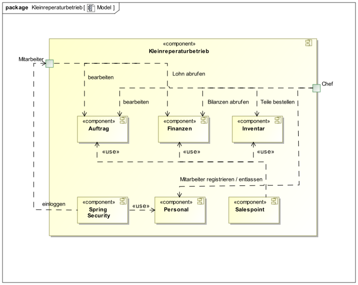

Top Level Architektur von unserer Software

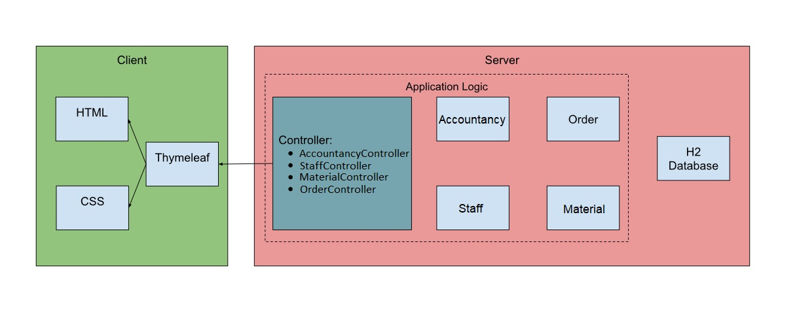

* Beschreibung der Architektur anhand der Top-Level-Architektur oder eines Client-Server-Diagramms

=== Entwurfsentscheidungen
==== Verwendete Muster
* Es wurde ein eigen Entwickeltes Design nach aktuellen Standards entwickelt. 

==== Persistenz

Die Anwendung verwendet Hibernate-Annotation-basiertes Mapping, um Java-Klassen Datenbanktabellen zuzuordnen. 
Als Datenbank wird H2 verwendet. Die Persistenz ist standardmäßig deaktiviert. Um den Persistenzspeicher zu aktivieren, müssen die folgenden zwei Zeilen in der Datei application.properties nicht kommentiert werden:
....
# spring.datasource.url=jdbc:h2:./db/videoshop
# spring.jpa.hibernate.ddl-auto=update
....

==== Benutzeroberfläche

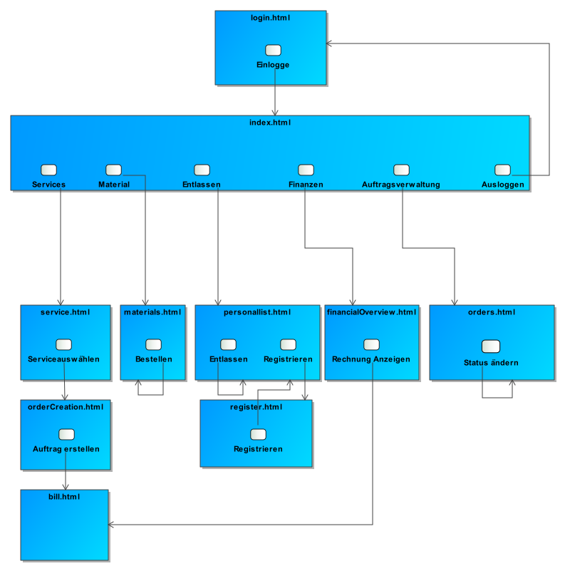

==== Verwendung externer Frameworks

[options="header", cols="1,3,3"]
|===
|Externe Klasse |Pfad der externen Klasse |Verwendet von (Klasse der eigenen Anwendung)
|Salespoint.BusinessTime |org.salespointframework.time.BusinessTime |catalog.CatalogController
|Salespoint.Cash |org.salespointframework.payment.Cash |order.OrderController
|Salespoint.Catalog |org.salespointframework.catalog.Catalog |catalog.VideoCatalog
|Salespoint.DataInitializer |org.salespointframework.core.DataInitializer a|
* catalog.CatalogInitializer
* customer.CustomerDataInitializer
* inventory.InventoryInitializer
|Salespoint.UniqueInventory |org.salespointframework.inventory.UniqueInventory a|
* catalog.CatalogController
* inventory.InventoryController
* inventory.InventoryInitializer
|Salespoint.UniqueInventoryItem |org.salespointframework.inventory.UniqueInventoryItem |inventory.InventoryInitializer
|Salespoint.Order |org.salespointframework.order.Order |order.OrderController
|Salespoint.OrderManager |org.salespointframework.order.OrderManager |order.OrderController
|Salespoint.OrderStatus |org.salespointframework.order.OrderStatus|order.OrderController
|Salespoint.Product |org.salespointframework.catalog.Product a|
* catalog.Disc
* order.OrderController
|Salespoint.Quantity |org.salespointframework.quantity.Quantity a|
* catalog.CatalogController
* inventory.InventoryInitializer
* order.OrderController
|Salespoint.Role |org.salespointframework.useraccount.Role a|
* customer.CustomerDataInitializer
* customer.CustomerManagement
|Salespoint.SalespointSecurityConfiguration |org.salespointframework.SalespointSecurityConfiguration |videoshop.WebSecurityConfiguration
|Salespoint.UserAccount |org.salespointframework.useraccount.UserAccount a|
* customer.Customer
* order.OrderController
|Salespoint.UserAccountManager |org.salespointframework.useraccount.UserAccountManager a|
* customer.CustomerDataInitializer
* customer.CustomerManagement
|Spring.Assert |org.springframework.util.Assert a|
* customer.CustomerController
* customer.CustomerDataInitializer
* order.OrderController
|Spring.Errors |org.springframework.validation.Errors |customer.CustomerController
|Spring.HttpSecurity |org.springframework.security.config.annotation.web.builders.HttpSecurity| videoshop.WebSecurityConfiguration
|Spring.Model |org.springframework.ui.Model a|
* catalog.CatalogController
* customer.CustomerController
* inventory.InventoryController
* order.OrderController
|Spring.Sort |org.springframework.data.domain.Sort |catalog.VideoCatalog
|Spring.SpringApplication |org.springframework.boot.SpringApplication |videoshop.VideoShop
|Spring.Streamable |org.springframework.data.util.Streamable |customer.CustomerManagement
|Spring.ViewControllerRegistry |org.springframework.web.servlet.config.annotation.ViewControllerRegistry |videoshop.VideoShopWebConfiguration
|Spring.WebMvcConfigurer |org.springframework.web.servlet.config.annotation.WebMvcConfigurer |videoshop.VideoShopWebConfiguration
|===

== Bausteinsicht
* Entwurfsklassendiagramme der einzelnen Packages

=== Staff
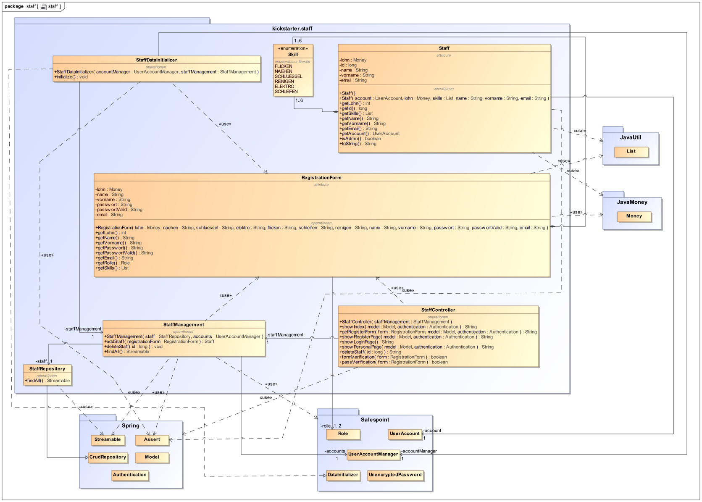

[options="header"]
|=== 
|Klasse/Enumeration |Description
|Staff              |Repräsentiert einen Mitarbeiter des Betriebes. Dieser hat einen Useraccount, einen Lohn und persönliche Daten wie Name.
|RegistrationForm   |Schnittstelle zwischen dem Formular und einem neuen Mitarbeiter. Hier stehen alle im Formular angegebenen Informationen zum Mitarbeiter bei der Registrierung drin.
|StaffManagement    |Verwaltungseinheit des Personals. Es regelt die UserAccounts und das StaffRepository.
|StaffController    |Kontrolliert die URL und führt die entsprechenden Aktivitäten aus und leitet den Nutzer anschließend zum richtigen Template weiter.
|StaffRepository    |Speicher der Mitarbeiter in einer Datenbank.
|StaffDataInitializer|Standarddaten für die Mitarbeiter, welche am Anfang des Programmstartes vorhanden sind.
|Skill              |Fähigkeit eines Mitarbeiters bestimmte Aktivitäten auszuführen.
|===

=== Material
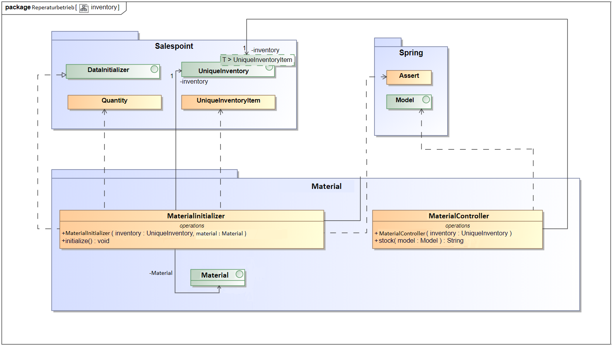

[options="header"]
|=== 
|Klasse/Enumeration |Description
|MaterialController    |Diese Klasse kontrolliert die URL und führt die entsprechenden Aktivitäten aus.
|MaterialInitializer|Standarddaten für das Inventar, welche am Anfang des Programmstartes vorhanden seien müssen.
|Material              |Sorgt datür dass wir ein Model haben, dass wir überführen können.
|===

=== Accountancy
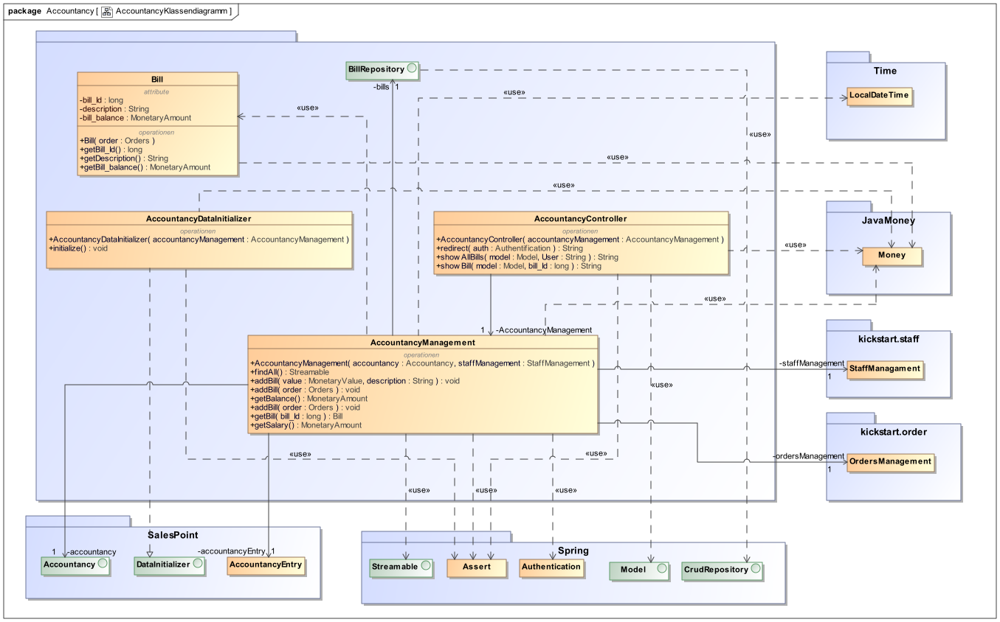

[options="header"]
|=== 
|Klasse/Enumeration |Description
|Bill			|Diese Klasse erzeugt ein Bill Objekt, welches dazu dient eine Rechnung darzustellen.
|BillRepository		|Datenbank, in der die Rechnungen gespeichert werden.
|AccountancyController 	|Diese Klasse kontrolliert, wer die Finanzübersicht aufruft und führt der Rolle entsprechend automatisch Funktionen aus.
|AccountancyManagement	|In dieser Klasse sind alle Methoden, die etwas mit den Finanzen des Unternehmens zu tun haben zu finden.
|AccountancyDataInitializer	|Initialisiert z.B. das Startguthaben des Accounts.
|===

=== Order
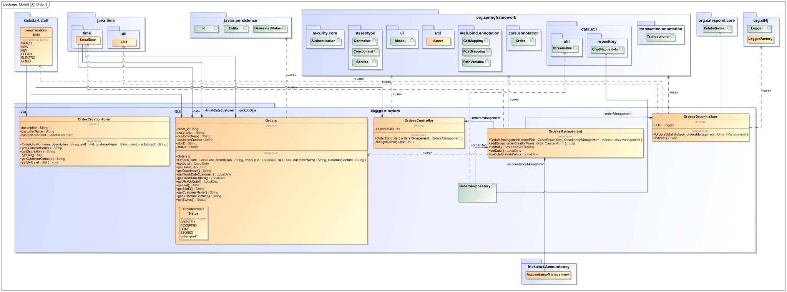

[options="header"]
|=== 
|Klasse/Enumeration |Description
|Orders             |Repräsentiert einen Auftrag. Dieser hat einen Status, einen Skill und einige Identifizierungsdaten.
|OrderCreationForm  |Schnittstelle zwischen Formular zur Auftragserstellung und einem Orders-Objekt
|Status             |Gibt den aktuellen Verarbeitungszustand eines Orders an.
|OrdersManagement   |Verwaltungsklasse der Aufträge, um einzelne Aufträge zu bearbeiten.
|OrdersController   |Diese Klasse kontrolliert die URL und führt die entsprechenden Orders-Aktivitäten aus.
|OrdersRepository   |Datenbank, in der Aufträge gespeichert werden.
|OrdersDataInitializer |Initialisiert einige Aufträge zum Programmstart.
|===

=== Rückverfolgbarkeit zwischen Analyse- und Entwurfsmodell

[options="header"]
|===
|Klasse/Enumeration (Analysemodell) |Klasse/Enumeration (Entwurfsmodell)
|Class -							|Class - bill (Financial)
|Class - Finanzverwaltung			|AccountancyManagement/AccountancyController/AccountancyDataInitializer
|Class - Inventwarverwaltung		|Class - MaterialController
|Class - Inventar					|GELÖSCHT
|Class - Material					|Interface - Material
|Class - Auftragsverwaltung			|Class - OrdersManagement/OrdersController/OdersDataInitializer
|Class - Auftrag					|Class - Orders
|Enum - status 						|Enum - Status
|Class - Personal					|Class - Staff
|Class - Personalverwaltung			|Class - StaffManagement/StaffController/StaffDataInitializer
|Enum - rolle						|Enum - Role
|Enum - Skill						|Enum - Skills
|===

== Laufzeitsicht
* Komponentenbezogene Sequenzdiagramme, welche darstellen, wie die Anwendung mit externen Frameworks (zB. Salespoint, Spring) interagiert.

=== Staff
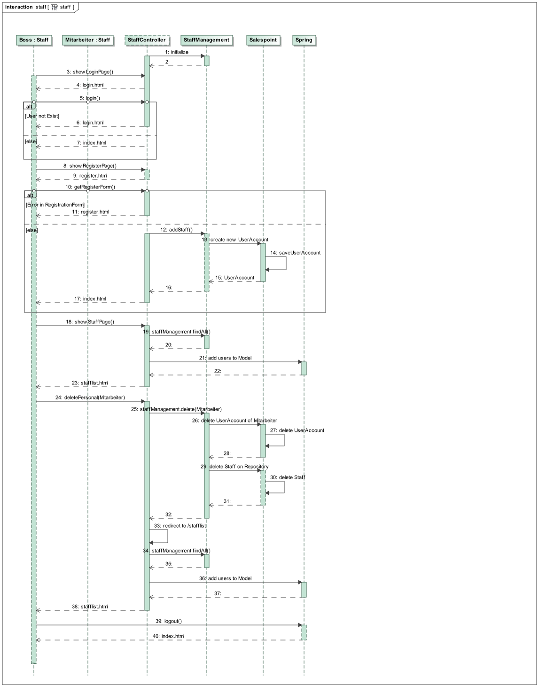

=== Material
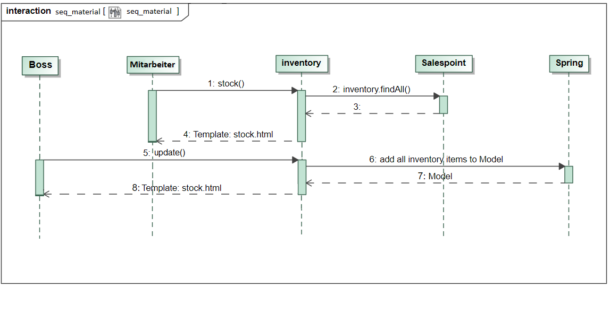

=== Accountancy
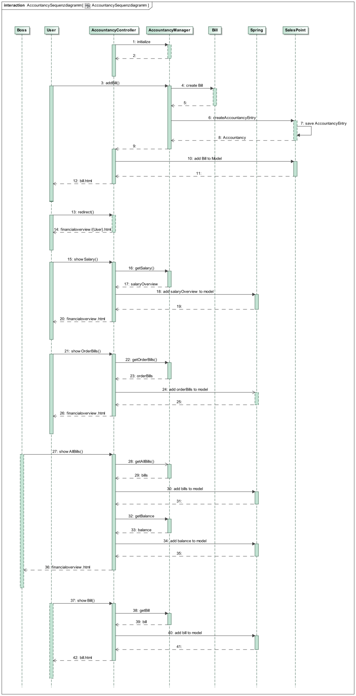

=== Order
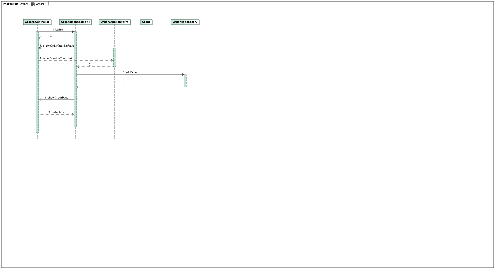

== Technische Schulden
* Auflistung der nicht erreichten Quality Gates und der zugehörigen SonarQube Issues
* Auflistung der nicht erreichten Quality Gates und der zugehörigen SonarQube Issues

