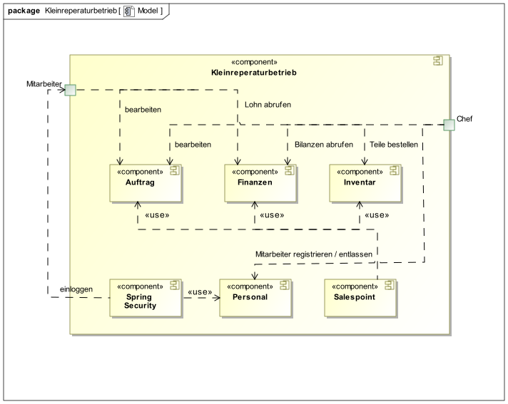
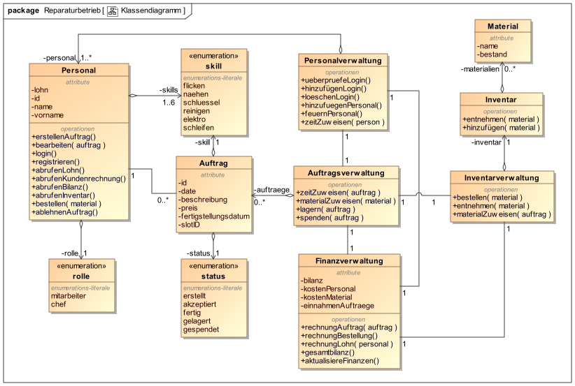

:toc: macro
:toc-title: Inhaltsvezeichnis
= Pflichtenheft
:project_name: Projektname
== __{project_name}__

[options="header"]
[cols="1, 1, 1, 1, 4"]
|===
|Version | Status      | Bearbeitungsdatum   | Autoren(en) |  Vermerk
|0.1     | In Arbeit   | 10.10.2019          | Christian, Eric, Lennart, Michael, Nico, Oliver       | Initiale Version
|===

toc::[]
:numbered:

== Zusammenfassung
In diesem Dokument werden die Anforderung des Kleinreperaturbetrieb erfasst und aufgeschlüsselt.
Auftraggeber und Softwareentwickler können anhand dieses Dokuments Absprachen festhalten und haben eine einheitliche
Übersicht der Softwareplanung. Dabei ist es wichtig, dass beide Seiten mit dem folgenden Dokument übereinstimmen und
somit Unstimmigkeiten vermieden werden können.

Um einem Missverständnis vorzubeugen werden hier einzelne Abschnitte näher beschrieben und ggf. mit UML-Diagrammen
verschiedener Art dargestellt. GUI Entwürfe werden in diesem Dokument ebenfalls festgehalten. Die Änderung an diesem Dokument sollten nach abschließender Absprache mit allen Stakeholdern möglichst minimal ausfallen, dies beugt Entwicklungsverzögerung und Missverständnissen vor.

Die Abschnitte unterteilen sich grob in Produktnutzer und Intressensgruppen, sowie verschiedene Anwendungsfälle und Anforderungen.
Desweiteren kann dieses Dokument jederzeit bearbeitet werden um neue Anforderung oder Änderung zu erfassen und transparent darzustellen (möglichst wenige).

== Aufgabenstellung und Zielsetzung
=== Kleinreparaturbetrieb

Mit Miss Mint Mending Points drängt eine neue Kette von Kleinreparaturbetrieben auf den Markt, die sich nach dem Slogan: "Alles aus einer Hand" durch ein besonders umfassendes Dienstleistungsangebot etablieren möchte. Jeder Miss-Mint-Reparaturbetrieb umfasst: +

  • eine Flickschusterei (Absätze, Sohlen, Nähte) +
  • einen Nähservice (Knöpfe, Nähte, Flicken) +
  • einen Schlüsseldienst (Schlüssel kopieren, Schilder gravieren) +
  • eine Schnellreinigung und Heißmangel (Wäsche, Anzüge, Leder) +
  • eine Elektrowerkstatt (Kabel ersetzen, löten) +
  • eine Scherenschleiferei (Scheren, Messer schärfen) +
  
Unsere Software soll geeignet für jeden Mitarbeiter im Betrieb sein und jedem einzelnen eine Möglichkeit geben
effizienter zu arbeiten durch Vereinfachung von Arbeitsschritten, wie die Erstellung neuer Aufträge. Dabei hat der
Chef des Betriebes einige zusätzliche Rechte und Funktionen auf die wir später noch eingehen werden.

Um die Software dynamisch zu gestalten wird es einen Login für jeden Mitarbeiter und Chef geben, damit die Mitarbeiter
keinen unbefugten Zugriff auf Inventar und Bilanzen bekommen und um die Aufträge übersichtlicher zu verteilen. Die
Registrierung neuer Konten erfolgt immer über das Konto des Chefs.

Die Auftragserstellung beginnt mit der Bestellung des Kunden an der Kasse, welche direkt und möglichst schnell im
System aufgenommen werden wird. Der Kunde zahlt die Reperaturkosten im Voraus. Anschließend soll ein Auftragszettel
mit eindeutiger Auftragsnummer und Fertigstellungstermin für den Kunden zum ausdrucken generiert werden.

Danach wird der Auftrag an einen Mitarbeiter mit dem benötigten Skill verteilt und in seinem Terminplan registriert.
Der Mitarbeiter hat nun die Option den Auftrag anzunehmen. Wird der Auftrag angenommen wird der Status des
Autrags auf "akzeptiert" gestellt. Es ist wichtig anzumerken, dass jeder Mitarbeiter den Status seiner Aufträge
einsehen und ändern kann. Ist der Mitarbeiter mit seinem Auftrag fertig, kann er den Status des Auftrags auf "fertig"
stellen. Nach dem Fertigstelligungstermin gibt es ein Zeitfenster von einer Woche in dem der Kunde die die Ware unter
Abgabe des Auftragszettels abholen kann.

Nach einer Woche wird das Produkt im System automatisch auf den Status "gelagert" gestellt und wandert in eine
betriebliche Aufbewahrungsstelle. Der Einlagerungstermin wird abgespeichert, da die Ware für 3 Monate eingelagert wird
und der Kunde unter Abgabe des Auftragszettels für eine Gebühr von 0,50 € pro Woche seine Ware immer noch abholen
kann. Waren die länger als 3 Monate im Lager gelagert wurden, werden im System auf "gespendet" gestellt und werden an
eine karitative Organisation weitergegeben. Umgekehrt verspricht der Betrieb aber auch für jeden Tag, um den sich die
Fertigstellung des Auftrages verpätet 10% Erstattung der Reperaturkosten.

Jeder Mitarbeiter hat in der Software zusätzlich zu der Funktion Aufträge zu erstellen, planen und verwalten noch die
Möglichkeit seinen eigenen Lohn einzusehen.

Neben dem normalen Benutzer (Mitarbeiter) gibt es auch noch den Chef des Betriebes, der Zugriff auf mehr Funktionen
der Software besitzt. Zusätzlich zu dem Lohn, den der Chef ebenfalls abrufen kann, hat der Chef auch Einsicht in die
Bilanzen und Rechnungen des ganzen Unternehmens. Der Chef hat außerdem Zugriff auf das Inventar und kann die Menge der
einzelnen Materialien überwachen und auch Matrial nachbestellen. Falls die Materialien knapp werden und unter eine
festgelegte Grenze fallen, sollen diese automatisch nachbestellt werden.
Der Chef hat außerdem auch Zugriff auf die Personalverwaltung. In diesem Bereich kann er neues Personal einstellen,
verwalten und entlassen.

Wir wollen eine Software entwickeln, die es dem Unternehmen einfacher macht Aufträge zu erstellen und zu verwalten
ohne komplexe Buchführung. Die Software soll dem Nutzern helfen, den Reperaturprozess besser im Auge zu halten und
Kunden somit in Sekunden zu erklären, wo sich ihre Ware im Zeitpunkt befindet. Wir versuchen außerdem das Layout so
übersichtlich wie möglich zu halten um eine hohe Effizienz zu gewährleisten.

== Produktnutzung
Das System soll eine interne Software zur Verwaltung von Aufträgen sein. Die Bereitstellung erfolgt über einen
Webdienst und wird vom Endnutzer via Browser genutzt.

Die Benutzer brauchen dabei keine näheren Kenntnisse von IT-Systemen oder SQL Lösungen haben. Daten werden in einer
persistenten Datenbank abgelegt.

Der Filialführer soll Artikel/Produkte nachbestellen können und neue Mitarbeiter einstellen oder bestehned
entlassen können.
Die Mitarbeiter sollen lediglich Aufträge annehmen, ablehnen oder erstellen können.

== Interessensgruppen (Stakeholders)
[[Interessengruppen]]
|=== 
|Name |Priorität (1-5) |Beschreibung |Ziele
|Chef des Unternehmens |5 |primärer Benutzer und Auftragsgeber des Projektes a|
- einfache Verwaltung des Betriebes
- Überblick über Finanzen und Aufträge
- automatische und manuelle Bestandsverwaltung
|Mitarbeiter |4 |Benutzer mit beschränktem Zugriff auf die Software a|
- einfache Erstellung von Aufträgen
- Darstellung eigener Aufträge
- Einsicht auf eigenen Lohn
|Entwickler |3 |Personen , die die Software entwickeln und später instand halten a|
- einfach zu bedienende Software
- erweiterbare Software
- spätere Wartung so gering wie möglich halten
|===

== Systemgrenze und Top-Level-Architektur

=== Kontextdiagramm
image:models/analysis/Kontextmodell.svg[Kontextdiagramm]

=== Top-Level-Architektur

== Anwendungsfälle

=== Akteure

// See http://asciidoctor.org/docs/user-manual/#tables
[options="header"]
[cols="1,4"]
|===
|Name |Beschreibung
|Chef  |Stellt neue Mitarbeiter ein und kann Artikel nachbestellen
|Mitarbeiter  |Bearbeitet Aufträge und nimmt Aufträge an
|nicht autorisierter Mitarbeiter  |Kommt als Akteur nur in **<<A002>>** vor
|Kunde  |Gibt Auftrag an der Kasse bei einem Mitarbeiter auf
|===

=== Überblick Anwendungsfalldiagramm

=== Anwendungsfallbeschreibungen

|===
|ID | **<<A001>>**
|Name	|Login/Logout
|Beschreibung	|Ein Nutzer muss sich dem System gegenüber authentifizieren und wird dann autorisiert, dadurch hat der
Benutzer Zugriff auf bestimmte Funktionalitäten. Beim Logout werden dem Nutzer seine Rechte(Rolle) entzogen.
|Akteure	|Personal (Personal umfasst Chef und Mitarbeiter)
|Auslöser	|Login: Personal möchte "versteckte" Funktionen nutzen. + Logout: Benutzer möchte die Software verlassen.
|Vorbedingung(en)	|Login: Das Personalmitglied ist nicht authentifiziert. + Logout: Der Personalmitglied ist
authentifiziert.
|Essenzielle Schritte	| 
Login: + 
1. Personalmitglied geht in den Bereich "Einloggen" + 
2. Personalmitglied trägt seine Anmeldedaten ein. 
3. + Personalmitglied drückt "Login" + 
Logout: + 
1. Nutzer wird beim betätigen des Ausloggen Buttons abgemeldet vom System.
|Erweiterung(en) |-
|===

|===
|ID                         |**<<A002>>**
|Name                       |Registierung
|Beschreibung                |Ein nicht autorisierter Mitarbeiter bekommt einen Account zugewiesen
|Akteure                     |Nicht autorisierter Mitarbeiter, Chef, Mitarbeiter
|Auslöser                    |Der Chef stellt einen neuen Mitarbeiter ein
|Vorbedingung(en)           |Ein neuer Mitarbeiter hat noch keinen Account
|Essenzielle Schritt(e)          |
1.  Ein neues Objekt Personal wird erzeugt
2.  Alle wichtigen Daten (Vorname, Name, ID und Lohn) werden angelegt vom Chef
3.  Anmeldedaten werden vom Chef festgelegt (Absprache mit dem neuen Mitarbeiter)

|Erweiterung(en)                 |-
|Funktionale Anforderungen    |<<F0020>>, <<F0021>>
|===

|===
|ID                          |**<<A003>>**
|Name                        |Reperaturübersicht
|Beschreibung                |Mitarbeiter wird vor der Aufgabe des Auftrages eine Übersicht geboten, bei der er
auswählt, welche Art von Reparatur es sich handelt
|Akteure                     |Mitarbeiter, Kunde
|Auslöser                    |Reparaturauftrag wird von Mitarbeiter erstellt
|Vorbedingung(en)           |Kunde fordert eine Reparatur an
|Essenzielle Schritt(e)          |
1.  System gibt eine Auswahlmöglichkeit für die Art der Reparatur
2.  Mitarbeiter wählt anhand des Kundenproblems die Art der Reparatur aus
3. 	System gibt einen Kostenvoranschlag aus 
4.  Mitarbeiter teilt dem Kunden den Kostenvoranschlag mit 
5. Kunde entscheidet sich für oder gegen die Reparatur

|Erweiterung(en)                 |-
|Funktionale Anforderungen    |<<F0020>>, <<F0021>>
|===

|===
|ID	|	**<<A004>>**
|Name	|Inventarübersicht
|Beschreibung	|Der Chef kann das Inventar einsehen und Artiekel/Produkte nachbestellen.
|Akteure	|Chef
|Auslöser	|Chef möchte das Inventar verwalten. (Also Artikel nachbestellen oder entnehmen)
|Vorraussetzung	|Chef hat sich dem System gegenüber authentifiziert und wurde als Chef autorisiert.
|Essenzielle Schritte	| 
1. Chef hat sich authentifiziert. +
2. Chef geht in der Navigationsleiste auf Inventar + 
3. Es wird das Inventar angezeigt und der Chef kann entnehmen oder nachbestellen.
|Erweiterung	|-
|===

|===
|ID                         |**<<A005>>**
|Name                       |Reparaturauftrag wird abgelehnt
|Beschreibung                |Der Reparaturauftrag wird vom Mitarbeiter abgelehnt
|Akteure                     |Mitarbeiter
|Auslöser                    |Reparaturauftrag wird vom Mitarbeiter manuell abgewiesen
|Vorbedingung(en)           a|Reparaturauftrag wird Mitarbeiter zugewiesen
|Essenzielle Schritt(e)          a|
1.  System weißt Mitarbeiter Reparaturauftrag zu
2.  Mitarbeiter meldet sich im System an 
3. 	Mitarbeiter lehnt Auftrag ab
3a. Optional: Mitarbeiter gibt eine Begründung an
3b. Chef hat Einsicht darüber 
4.  System sucht neuen Mitarbeiter für den Reparaturauftrag

|Erweiterung(en)                 |Optional: System oder Mitarbeiter können vor Auftragsannahme den Reparaturauftrag
ablehnen
|Funktionale Anforderungen    |<<F0020>>, <<F0021>>
|===

|===
|ID |	**<<A006>>**
|Name |Reparaturauftrag wird erteilt
|Ziel im Kontext  |Kunde bekommt sein repariertes Objekt zurück 
|Akteure  | Mitarbeiter, (Kunde), Chef 
|Trigger  |Kunde geht zum Kundenschalter (Mitarbeiter) und gibt einen Auftrag auf
|Essenzielle Schritte |1.	Kunde gibt sein zu reparierendes Objekt ab und zahlt einen definierten Betrag +
2.	Mitarbeiter meldet sich im System an +
3.	Mitarbeiter erstellt einen Auftrag und gibt ihn zur Bearbeitung weiter +
4.	Status des Auftrages ändert sich und es wird ein Mitarbeiter dem Auftrag zugeteilt (automatisch) +
5.	Mitarbeiter bekommt eine vom System erstellte Rechnung und gibt sie dem Kunden +
6.	Gleicher Mitarbeiter, anderer Mitarbeiter oder der Chef entnimmt Materialien aus dem Inventar und bearbeitet den
Auftrag +
7.	Status ändert sich auf „fertig zur Abholung“ +
8.	Mitarbeiter übergibt Kunden sein repariertes Objekt +
|Erweiterung  |
3a. Mitarbeiter teilt dem Kunden mit, dass das Objekt nicht repariert werden kann und erstattet ihm das Geld +
6a. Mitarbeiter findet keine Materialien und teilt es dem Chef mit +
6a1. Chef bestellt weitere Materialien nach +
7a. Status wird nicht zur vorgegeben Zeit fertig +
7a1. Objekt ist zur Abholung bereit, wird aber nicht abgeholt und ins Lager getan +
7a2. Objekt wird nach einer Zeit nicht abgeholt und wird daher gespendet +
8a. In Fall 7a. wird dem Kunden einen Teil des Geldes für die Reparatur als Gutschrift ausgestellt +
|===

|===
|ID                         |**<<A007>>**
|Name                       |Bezahlvorgang
|Beschreibung                |Ein Kunde gibt einen Reparaturauftrag auf und bekommt eine Rechnung
|Akteure                     |Kunde, Mitarbeiter
|Auslöser                    |Reparaturauftrag wird angenommen
|Vorbedingung(en)           a|Kunde gibt einen Reparaturauftrag auf
|Essenzielle Schritt(e)          a|
1.  Das System zeigt dem Mitarbeiter eine Rechnung für den Kunden an
2.  Mitarbeiter druckt die Rechnung aus 
3. 	Mitarbeiter übergibt Kunden die Rechnung
4.  Kunde zahlt den angegebenen Betrag und lässt sein zu reparierendes Objekt da

|Erweiterung(en)                 |-
|Funktionale Anforderungen    |<<F0020>>, <<F0021>>
|===

|===
|ID | 	**<<A008>>**
|Name	|Waren Abholung
|Beschreibung |Der Kunde möchte sein Repariertes Produkt (oder ein Produkt eines Abgebrochenen Auftrages) abholen.
|Akteure | Kunde, Personal(Chef/Mitarbeiter)
|Auslöser |Kunde möchte sein Produkt abholen.
|Vorraussetzung | Personal am System authentifiziert.
|Essenzielle Schritte | 
1. Kunde kommt zum Mitarbeiter ins Geschäft und übergibt die Auftragsbestätigung/Abholschein. +
2. Mitarbeiter überprüft im System den Status des Produktes +
3. Mitarbeiter holt Produkt + 
4. Mitarbeiter gibt Kunden Rechnung bzw. Gutschrift +
5. Abrechnung + 
6.Übergibt Produkt an Kunden
|Erweiterung | 
2a. Wenn Produkt zulange im Lager, gibt der Mitarbeiter Rechnung raus mit der Mitteilung: 2das Produkt wurde gespendet2
|===

|===
|ID |	**<<A009>>**
|Name |Auftragsübersicht
|Beschreibung |Es soll eine Einsicht der aktuellen Aufträge möglich sein.
|Akteuere	| Personal (Chef/Mitarbeiter)
|Auslöser | Der Personal möchte alle aktuellen Aufträge einsehen.
|Vorraussetzung | Personal ist im System authentifiziert.
|Essenzielle Schritte| 1. Personal geht in Navigationsleiste auf Aufträge +
2. Anstehende Aufträge werden angezeigt
|Erweiterung	| 2a. Personal kann vergangene Aufträge anzeigen lassen.
|===

|===
|ID	|	***<<A010>>**
|Name | Lohnansicht
|Beschreibung | Dem Personal der Firma soll es möglich sein den eigenen Lohnbescheid einzusehen im System.
|Akteure | Personal (Chef/Mitarbeiter)
|Auslöser | Personal möchte Lohnübersicht einsehen.
|Vorraussetznung | Benutzer ist am System authentifiziert und Autorisiert
|Essenzielle Schritte | 
1. Benutzer geht in der Navigationsleiste auf Lohnübersicht. + 
2. Kann aktuelle Monatsübersicht sehen +
|Erweiterung | 2a. Mitarbeiter kann Monat auswählen
|===

|===
|ID	|**<<A011>>**
|Name	|Bilanz
|Beschreibung	|Der Chef erhält einsicht zu der Bilanzübersicht (welche Monatsweise einsehbar ist)
|Akteure	|Chef
|Auslöser	|Der Chef möchte die aktuelle (oder vergange) Bilanzübersicht einsehen.
|Vorraussetznung	|Der Chef wurde vom System authentifiziert.
|Essenzielle Schritte	| 
1. Chef geht in der Navigationsleiste auf Bilanz. + 
2. Chef wählt Monat aus. (Aktueller Monat wird automatisch angezeigt) +
|Erweiterung |-
|===

== Funktionale Anforderungen

=== Muss-Kriterien
|===
| Benutzerverwaltung | Der Chef soll neue Mitarbeiter einstellen und entlassen können. Außerdem kann er sowohl bei der
  Erstellung des Mitarbeiteraccounts, aber auch später dessen Daten und Fähigkeiten einstellen und anpassen können.
| Auftragserstellung | Mitarbeiter sollen Kundenaufträge erstellen und freien Zeitslots zuweisen können.
| Bilanzdarstellung/-berechnung | Alle Käufe von Materialen, Gehälter, Gewinne von erledigten Aufträgen und sonstige
Einnahmen und Ausgaben sollen automatisch kalkuliert und (ausschließlich vom Chef) eingesehen werden können.
| Lohndarstellung/-berechnung | Die Lohnberechnung gehört zur Bilanzberechnung, allerdings kann diese ebenfalls von
den Mitarbeitern eingesehen werden. Natürlich kann jeder Mitarbeiter nur auf seine eigene Lohnabrechnung zugreifen.
| Produkt-/Artikelbestellung | Das Inventar enthält und verwaltet alle Produkte, die für die einzelnen Dienstleistungen
benötigt werden. Sollte der Inventarbestand eines bestimmten Produktes einen festgelegten Wert unterschreiten, wird vom
System automatisch nachbestellt.
| HTML Rechnungsdarstellung | Die Rechnung wird automatisch generiert und für den Kunden dargestellt.
| Automatisches Zuweisungssystem | Ein neuer Auftrag wird automatisch einem Mitarbeiter zugewiesen, der die
entsprechenden Fähigkeiten besitzt und für den nächstbesten Zeitraum zur Verfügung steht.
| Authentifizierungs- und Autorisierungsverfahren | Beim Registrieren und Einloggen müssen entsprechende
Authentifizierungsverfahren die Identität der Person validieren. Dies wird benötigt, um das System vor Fremdnutzung zu
schützen, aber auch um den Mitarbeitern den Zugriff zu bestimmten Bereichen zu erlauben oder zu verweigern.
|===

=== Kann-Kriterien
 * Ansprechende visualle Darstellung des Auftragsfortschrittes
 * PDF für Lohn/Rechnung
 * Diagrammdarstellung der Billanz
 * Interface version 2.0

== Nicht-Funktionale Anforderungen

=== Qualitätsziele

|===
|Qualitätsziele |1 |2 |3 |4 |5
|Sicherheit | | | | |x
|Wartbarkeit | | | |x |
|Benutzerfreundlichkeit | | |x | |
|Performance | |x | | |
|Design |x | | | |
|===

=== Konkrete Nicht-Funktionale Anforderungen

[options="header", cols="2h, 1, 3, 12"]
|===
|ID
|Version
|Name
|Description

|[[NF0010]]<<NF0010>>
|v0.1
|Verfügbarkeit - Betriebszeit
a|
Das System sollte 90% der Zeit verfügbar sein.

|[[NF0020]]<<NF0020>>
|v0.1
|Security - Passwort speicher
a|
Passwörter von allen Benutzern müssen gehashed abgespeichert werden (Diebstahlschutz).

|===

== GUI Prototyp

=== Projekthomepage / Login
Auf dieser Seite hat der Benutzer die Möglichkeit sich einzuloggen . Wenn der Benutzer noch nicht im System
eingeschrieben ist, dann soll er auf "Sich Registrieren" klicken und sich auf die Registrierungsseite weiterleiten
lassen.

=== Registrierung
Auf dieser Seite wird ein neuer Mitarbeiter vom Chef einschreiben, seine Fähigkeiten und persönliche Daten angeben und schon ein Passwort für ihn festgelegt.

=== Services
Der Benutzer hat die Möglichkeit, einen Service auszuwählen

=== Einkauf
Der Benutzer muss nach der Bestellung von einem Service die Anzahl von Materialen, die gebraucht werden sollen,
auswählen.
Wenn die Anzahl von Materialen unter der Grenze liegt, dann muss das System neue Materialen bestellen.

=== Finanzübersicht
Der Benutzer (Chef) hat die Möglichkeit, einen Überblick über die Finanzen zu bekommen.
image:GUI_Prototyp/Finanzübersicht.png[Login , 100%, 100%, pdfwidth=100%,align=center]

=== Materialübersicht
Der Benutzer (Chef) hat die Möglichkeit, einen Überblick über die Anzahl von Materialen, die im Inventar liegen anzusehen .
image:GUI_Prototyp/Materialübersicht.png[Login , 100%, 100%, pdfwidth=100%,align=center]

=== Personalliste
Der Benutzer (Chef) hat die Möglichkeit, einen Überblick über das Konto des Mitarbeiters zu bekommen. Wie viele und
welche Aufgaben er schon abgeschlossen hat, zeigt sein aktueller Zustand (wenn eine Aufgabe zur verfügung steht oder
nicht).

=== Produktzustand
Der Benutzer hat die Möglichkeit, ein Überblick und alle Informationen über alle Produkte, die im Lager liegen, zu
bekommen.

=== Navigationübersicht
image:GUI_Prototyp/Navigationübersicht.jpeg[Login , 100%, 100%, pdfwidth=100%,align=center]

== Datenmodell

=== Überblick: Klassendiagramm

=== Klassen und Enumerationen
[[Klassen_und_Enumerationen]]
// See http://asciidoctor.org/docs/user-manual/#tables
[options="header"]
|===
|Klasse/Enumeration |Beschreibung
|Personal           |Das Personal sind alle Personen, die direkt die Software nutzen. Sie müssen sich dafür einloggen,
nachdem der Login vom Chef eingerichtet wurde. Sie können Aufträge annehmen und bearbeiten.
|rolle               |Die Rolle hat den Zweck zwischen den Chef und Mitarbeitern zu unterscheiden, da der Chef einige
Funktionalitäten nutzen kann, die für Mitarbeiter nicht zugänglich sind.
|skill              |Der Skill ist die Fähigkeit, die für die Durchführung eines Auftrags notwendig ist. Jeder
Mitarbeiter besitzt eine Liste der Skills.
|Personalverwaltung |Die Personalverwaltung kümmert sich um sämtliche Angelegenheiten des Logins und der Registrierung und um die Übersicht über die Mitarbeiter. Außerdem ordnet es den Mitarbeitern ihre Zeitslots für die Aufträge zu.
|Auftrag            |Der Auftrag ist ein vom Kunden kommender Auftrag, der durch einen Mitarbeiter erstellt und
bearbeitet wird. Er verwendet Material und einen Zeitslot bei einem Mitarbeiter.
|status             |Der Status repräsentiert den jeweiligen Stand eines Auftrags und wird vom zuständigen
Mitarbeiter als auch vom System verändert.
|Auftragsverwaltung |Die Auftragsverwaltung kümmert sich um die Aufträge. Es ordnet Aufträgen ihre Zeitslots und ihr benötigtes Material zu. Außerdem registriert es das Datum und kann somit den Status des Auftrags ändern.
|Finanzverwaltung   |Die Finanzverwaltung kümmern sich um alles, dass mit Geld zu tun hat. Es erstellt sämtliche Rechnungen
und man kann eine Gesamtbilanz aufrufen.
|Inventar           |Das Inventar ist für die Organisation der einzelnen Materialien zuständig und gewährt den Zugriff
auf eben diese.
|Material           |Das Material repräsentiert eine für die Aufträge notwendige Ressource. Es wird als Menge/Bestand
gehandhabt.
|Inventarverwaltung |Die Inventarverwaltung kümmert sich um das Inventar. Es bestellt also bei einer unterschrittenen Mindestmenge automatisch neues Material und stellt das Material für die Aufträge bereit.
|===

== Akzeptanztestfälle
|===
|ID |**<<Ak010>>**
|Anwendung  |Registrierung 
|Voraussetzungen  |Mitarbeiter muss zuvor vom Chef eingestellt worden sein
|Ereignis  |Mitarbeiter wird im System eingetragen (Name, Vorname, ID, etc.)
|Akzeptiertes Resultat |
  • Chef legt LogDaten für Mitarbeiter an +
  • Mitarbeiter bekommt diese zugewiesen +
  • Mitarbeiter meldet sich zum ersten mal an +
  • Mitarbeiter bestätigt sein Account +
  
|===

|===
|ID |**<<Ak011>>**
|Anwendung  |Registrierung wiederrufen
|Voraussetzungen  |Mitarbeiter muss bereits einen Account haben 
|Ereignis  |Chef entlässt Mitarbeiter
|Akzeptiertes Resultat |
  • Chef lässt im System den Account sperren + 
  • Chef lässt ggf. den Account löschen +
  • Einträge im System (Name, Vorname, ID, etc.) werden gelöscht +
  
|===

|===
|ID |**<<Ak020>>**
|Anwendung  |Login/LogOut(Anmelden) 
|Voraussetzungen  |Mitarbeiter muss zuvor vom Chef als Mitarbeiter registriert worden sein
|Ereignis  |Mitarbeiter meldet sich mit den vorgegebenen Anmeldedaten an
|Akzeptiertes Resultat |
  • Mitarbeiter wird vom System als Mitarbeiter erkannt (login Name) + 
  • System gibt eine Rückmeldung dass die Anmeldung nicht erfolgreich war (Anmeldung fehlgeschlagen) +
  • Mitarbeiter wählt den Button "LogOut" an und wird vom System ausgelogt +
  • System logt Mitarbeiter automatisch nach einer Zeit aus +
  
|===

|===
|ID |**<<Ak021>>**
|Anwendung  |Login/LogOut(Anmelden) fehlgeschlagen 
|Voraussetzungen  |Mitarbeiter muss zuvor vom Chef als Mitarbeiter registriert worden sein
|Ereignis  |Mitarbeiter meldet sich mit den vorgegebenen Anmeldedaten an
|Akzeptiertes Resultat |
  • Account wird gesperrt (wenn Anmeldung zu oft fehlgeschlagen ist) +
  • System gibt dem Chef eine Mitteilung +
  • Mitarbeiter muss sich vom Chef den Account freischalten lassen +
  • Chef kann nur alleine den Account freischalten (Misbrauchsvorbeugung) +
  
|===

|===
|ID |**<<Ak030>>**
|Anwendung  |Reperaturübersicht 
|Voraussetzungen  |Mitarbeiter muss sich zuvor erfolgreich angemeldet haben
|Ereignis  |Mitarbeiter will einen Kundenauftrag aufnehmen
|Akzeptiertes Resultat |
  • Mitarbeiter wählt von 6 verschiedenen Reparaturarten eine aus +
  • System wählt auf grundlage dessen die Mitarbeiter dafür aus +
  • Kunde gibt eine Reparaturart an, die nicht aufgelistet ist (Reperaturauftrag fehlgeschlagen) +
  
|===

|===
|ID |**<<Ak031>>**
|Anwendung  |Reperaturübersicht (Reparaturauftrag ablehnen)
|Voraussetzungen  |Mitarbeiter muss sich zuvor erfolgreich angemeldet haben
|Ereignis  |Mitarbeiter logt sich im System ein und bekommt vom System einen Reparaturauftrag zugeteilt 
|Akzeptiertes Resultat |
  • Mitarbeiter lehnt den Auftrag ab + 
  • Mitarbeiter bestätigt die Annahme des Auftrages nicht (wird als abgelehnt weitergeleitet mit vermerk) + 
  • System meldet das dem Chef weiter +
  
|===

|===
|ID |**<<Ak040>>**
|Anwendung  |Inventarübersicht 
|Voraussetzungen  |Mitarbeiter muss sich zuvor erfolgreich angemeldet haben
|Ereignis  |Mitarbeiter will einen Reparaturauftrag ausführen 
|Akzeptiertes Resultat |
  • System gibt dem Mitarbeiter die benötigten Materialien vor +
  • Mitarbeiter sucht diese im Inventar und benutzt diese für die Reperatur +
  
|===

|===
|ID |**<<Ak050>>**
|Anwendung  |Login(Anmelden) 
|Voraussetzungen  |Mitarbeiter muss zuvor vom Chef als Mitarbeiter registriert worden sein
|Ereignis  |Mitarbeiter meldet sich mit den vorgegebenen Anmeldedaten an
|Akzeptiertes Resultat |
  • Mitarbeiter wird vom System als Mitarbeiter erkannt (login Name) +
  • System erteilt nur die Mitarbeiter Rolle +
  • Mitarbeiter bekommt die Möglichkeit, einen Auftrag zu erstellen +
|===

|===
|ID |**<<Ak060>>**
|Anwendung  |Mitarbeiter erstellt einen Auftrag  (Auftrag erstellen
|Voraussetzungen  |Mitarbeiter bekommt einen Reparaturauftrag von einem Kunden
|Ereignis  |Mitarbeiter erstellt einen Auftrag und berechnet einen vordefinierten Betrag beim Kunden ab 
|Akzeptiertes Resultat |
  • Mitarbeiter lehnt die Reparatur ab (Außnahmefall) +
  • Mitarbeiter erstellt einen Reparaturauftrag + 
  • System teilt dem Auftrag einen Mitarbeiter zu +
  • Auftrag wird weiter bearbeitet + 
  • Mitarbeiter händigt Kunden Kundenrechnung aus (Kundenrechnung) + 
|===

|===
|ID |**<<Ak070>>**
|Anwendung  |Bezahlvorgang 
|Voraussetzungen  |Auftrag muss zuvor erstellt worden sein
|Ereignis  |Ein Mitarbeiter erstellt den Reparaturauftrag
|Akzeptiertes Resultat |
  • Mitarbeiter erstellt den Reparaturauftrag +
  • System erstellt eine Rechnung und Mitarbeiter druckt diese aus +
  • Mitarbeiter übergibt Kunden die Rechnung +
  • Kunde bezahlt die Rechnung und Mitarbeiter vermerkt dies im System +
  • Kunde bezahlt die Rechnung nicht und Reparaturauftrag wird von Mitarbeiter erst garnicht erstellt +
	
|===

|===
|ID |**<<Ak080>>**
|Anwendung  |Auftrag ist fertig 
|Voraussetzungen  |Mitarbeiter muss die Reparatur abschließen 
|Ereignis  |System ändert Status in „Zur Abholung bereit“
|Akzeptiertes Resultat |
  • Mitarbeiter übergibt Kunden sein repariertes Objekt zurück +
  • Mitarbeiter übergibt Kunden sein repariertes Objekt zurück und zusätzlich eine Gutschrift (verspätete Reparatur) +
  • Objekt wird nicht abgeholt und wird vorübergehend im Inventar gelagert +
  • Objekt wird gespendet weil der Kunde es nach längerer Zeit immer noch nicht abgeholt hat +
  • System speichert Auftrag ab als abgeschlossen +
|===

== Glossar
Das Glossar beinhaltet eine Liste aller Wörter und Phrasen, welche in diesem Projekt genutzt werden und einer konkreten
Beschreibung bedarfen, um Missverständnisse zwischen den Entwicklern und den Kunden vorzubeugen.

:Client_Description: Synonym for the customer of this project ({company_name})
:domain_ref: Siehe <<Interessengruppen>>
:domain_ref_2: Siehe <<Klassen_und_Enumerationen>>
//Note: you could do it like this, but this might not work with mutli-line texts. Consult the documentation for additional information

[options="header", cols="1h, 4"]
[[glossar]]
|===
|Auftrag | {domain_ref_2}
|Auftragstatus | {domain_ref_2}
|Begriff |Beschreibung
|Chef des Unternehmens | {domain_ref}
|Entwickler | {domain_ref}
|Finanzen | {domain_ref_2}
|Inventar/Stock | {domain_ref_2}
|Konto | persönliches Profil eines Mitarbeiters
|Kunde | Gibt Auftrag bei einem Mitarbeiter an der Kasse ab. Ist nicht direkt Teil der Programmlogik
|Lager | Beinhaltet die Kundenware, welche repariert, aber noch nicht abgeholt/gespendet wurde
|Login | Erfolgreiche Authetifizierung nach dem Eingeben der korekten Anmeldedaten
|Mitarbeiter/Personal | {domain_ref}
|Produkt/Material/Artikel | {domain_ref_2}
|Rechnung | Wird vom System für den Kunden erstellt
|Registrierung | Erfolgreiches Anlegen eines Nutzerkontos nach dem Eingeben aller notwendigen Daten
|role | {domain_ref_2}
|Skill | {domain_ref_2}
|System | {domain_ref_2}
|Terminplan | Plan, der Auskunft über die Zeitslots und die ihnen zugeordneten Aufträge und Mitarbeiter gibt
|Ware | Eigentum des Kunden, welches abgegeben, repariert, gelagert, abgeholt oder gespendet wird
|Zeitslot | Ein Zeiteinheit, der ein Auftrag zugewiesen wird. Ein Mitarbeiter sollte den Auftrag innerhalb eines
Zeitslots fertig stellen
|===

